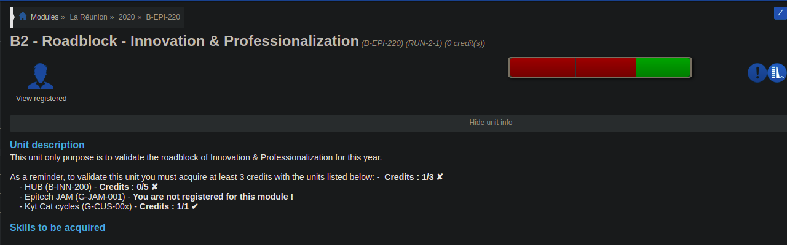

    <h1>Web Extension Epitech RoadBlock v1.2</h1>

 <strong> Adds additional information to roadblock modules https://intra.epitech.eu </strong>

</img>

## Working On:

- Google Chrome
- Android
- Firefox

## How to install
<ul>
	<li>
        Chrome
        <ul>
            <li>Just add it to chrome from the <a href="https://chrome.google.com/webstore/detail/epitech-roadblock/foapohjmcdnoijommffjdbefjpakplej/related?hl=fr">store</a></li>
        </ul>
    </li>
	<li>Android
		<ul>
			<li> Install Kiwi Browser from the PlayStore or other store</li>
			<li> And Just add it to chrome from the <a href="https://chrome.google.com/webstore/detail/epitech-roadblock/foapohjmcdnoijommffjdbefjpakplej/related?hl=fr">store</a></li>
		</ul>
	</li>
    <li>Firefox
		<ul>
            <li><pre>git clone https://github.com/alwyn974/EpitechRoadBlockExt.git</pre></li>
			<li> Go to <a href="about:debugging#/runtime/this-firefox">"about:debugging#/runtime/this-firefox"</a> </li>
			<li> Load Temporary Add-on</li>
            <li> Load the folder EpitechRoadBlockExt</li>
		</ul>
	</li>
</ul>

> :bulb: Don't forget to put a star on the project to support the project
